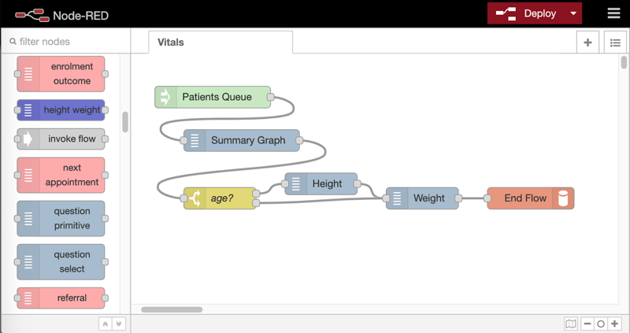
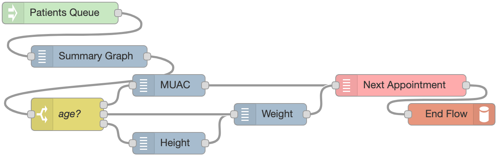
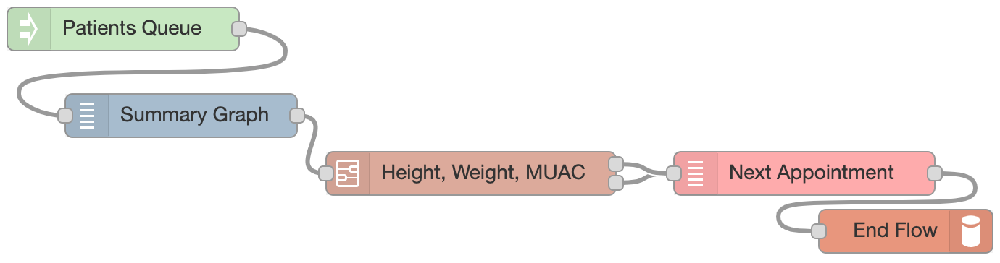
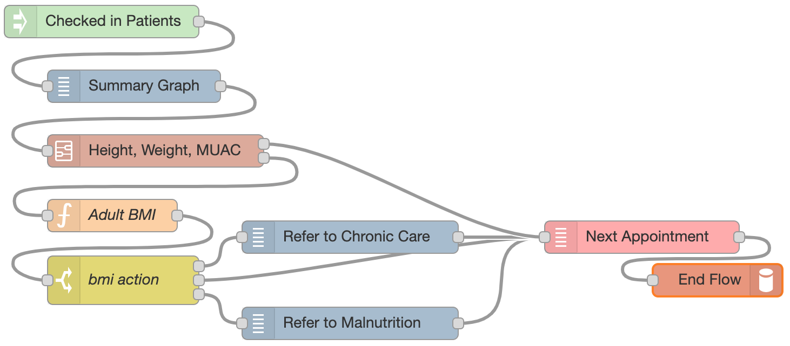

**Author information page**

Christian Neumann a, \*, Elizabeth L. Dunbar b,
Jeremy U. Espino a,c, Timothy M. Mtonga a,  
Gerald P. Douglas a,c

a Global Health Informatics Institute, Lilongwe, Malawi

b Department of Human Centered Design and Engineering,
University of Washington, Seattle, Washington, USA 

c Department of Biomedical Informatics, University of
Pittsburgh, Pittsburgh, USA

**\* Corresponding author** address: Global Health Informatics
Institute, Area 3, Lilongwe, Malawi

Email: info@ghii.org

Tel: +265-994-444-449

Care:Bricks - An LMIC-First Implementation for agile development of
process-centric and guideline-driven point of care EMR systems

Christian Neumann a, \*, Elizabeth L. Dunbar b,
Jeremy U. Espino a,c, Timothy M. Mtonga a,  
Gerald P. Douglas a,c

a Global Health Informatics Institute, Lilongwe, Malawi

b Department of Human Centered Design and Engineering,
University of Washington, Seattle, Washington, USA 

c Department of Biomedical Informatics, University of
Pittsburgh, Pittsburgh, USA

**Background & Purpose:** The ability to reinforce clinical guidelines
to optimize quality of care is a driving factor for electronic health
records implementation. Digital systems that ensure completeness of data
required for health programs, especially HIV, are now commonplace in
most low- and middle-income countries. However, these systems are
designed more toward supporting monitoring, evaluation, and reporting
activities with clinical care support and guideline adherence often
added as an afterthought. These systems also require dedicated
developers and are difficult to upgrade as clinical guidelines change.
This manuscript describes the rationale and prototypical implementation
of a set of tools for rapid design and deployment of point of care,
electronic medical record systems.

**Methods:** We outline a system of flexible components designed to
support effective integration of clinical guidelines in LMICs. To
minimize hardware costs and provide a system that users with low
computer literacy can quickly learn to use, the system is also designed
to run on small, low-power, touchscreen-enabled devices.

**Results:** We developed Care:Bricks, a set of modular tools divided
into four components: a design environment based on a graphical workflow
editor, a runtime environment to execute the design at a health facility
at the point of care, a data representation and storage engine, and a
core development environment.

**Conclusions:** Adapting electronic systems to changes in clinical
guidelines is often slow and expensive. Agile, scalable, and low-cost
implementations that a system like Care:Bricks can support offer a new
model for sustaining EMR implementations in low-resource settings where
employing dedicated developers is costly or impossible.

**Keywords:** EMR, EHR, Clinical Decision Support, Digital Guideline
Implementation, Digital job aid, Digital health

1.  Introduction

    1.  Clinical Guidelines

Clinical guidelines are a common mechanism for standardizing and
improving the quality of care by synthesizing available biomedical
knowledge into clear, reliable, reproducible, and applicable steps or
instructions \[1\] \[2\]. The Institute of Medicine defines clinical
guidelines as “systematically developed statements to assist
practitioner and patient decisions about appropriate health care for
specific clinical circumstances” \[3\]. Clinical guidelines have many
potential benefits such as improved health outcomes for patients,
increased quality and consistency of clinical decisions by healthcare
practitioners, and reduction of healthcare system costs \[4\]. Despite
the benefits offered by good clinical guidelines, uptake and adherence
remains a challenge \[5\]. Patient preferences, lack of clarity,
clinically inapplicable instructions, and a resistant organizational
culture are some of the reasons that contribute to low utilization and
uptake of clinical guidelines \[1\] \[6\].

2.  Job Aids

One common way to improve the clarity and utility of published
guidelines is through job aids. Job aids are any external resources used
to support the performance of a task by guiding, directing, and
enlightening performance of an activity or decision \[7\]. Job aids can
simplify complex guidelines, improve clarity of instructions and
condense information into memorable snippets to support healthcare
providers. Job aids have been particularly useful in low-resource
settings where critical human resources shortages have necessitated task
shifting from highly-trained staff to capable, untrained assistants
\[8\].

A more enhanced version of a job aid is the use of computer systems to
provide clinical decision support (CDS). Similar to how clinical
guidelines inform decision making by healthcare providers, CDS systems
provide targeted clinical and contextual knowledge such as patient and
other health information to enhance the decision-making process \[9\]
\[10\]. Unlike paper job aids, CDS systems can utilize and synthesize a
wider range of knowledge to provide greater insight during a clinical
consultation. However, CDS are just another form of a job aid i.e.,
digital job aid, and are not meant to replace people \[11\].

To increase their impact, job aids should be designed to seamlessly
integrate and improve clinical workflows. Friedman \[12\] asserts that
the development, implementation, and evaluation of such tools belongs to
the field of informatics. In his seminal papers describing the field of
informatics, Friedman \[11\] \[12\] argues that informatics is about
placing information resources in the hands of users such that their
performance or experience is better than when the information resource
was not available. This assertion is a fundamental theorem of biomedical
informatics and a guiding principle for this approach. To achieve this,
Friedman \[11\] argues that information resources must be built for the
benefit of people and offer something that the person doesn't already
know or have. In other words, systems must make the work of healthcare
providers easier, better, faster, or more satisfying. This can be
attained if systems are designed from both a user- and process-centric
perspective with the aim of improving workflows first rather than merely
collecting data. Improving processes is an often-forgotten aspect of
electronic systems especially in low-resource settings where data
capture typically becomes the primary focus of digital systems rather
than data as a by-product of clinical decision support.

3.  Clinical Guidelines in Low- And Middle-Income Countries (LMIC) EMRs

Douglas et al. illustrate Friedman’s theorem with their electronic
medical record (EMR) system implementation, BART (Baobab Anti-Retroviral
Therapy), where the healthcare provider is stepped through a series of
questions drawn from Malawi’s Antiretroviral Therapy guidelines using a
wizard-style, single question per screen touchscreen user interface
\[13\]. This approach allows the healthcare provider to recall and
incorporate aspects of the clinical guideline into a natural discourse
with the client while at the same time enforcing a standard workflow. As
a result, this approach not only improves care, but also improves the
process through which complete data are collected. The wizard design
simplifies complex processes and enforces a clear sequence of steps with
each step displayed as a single screen showing only pertinent
information, focussing user attention and decreasing odds of user error
\[14\].

Unlike other fields, scientific knowledge and healthcare practices
change quickly. For example, in HIV care, clinical guidelines undergo
frequent revisions due to changes in available interventions and changes
in evidence on the benefits and harms of the interventions among others
\[15\]. As such, systems built to support this work, like BART, must
keep up with the changes or risk becoming obsolete. For example, when
medication regimens change, the software needs to reflect those changes
immediately, and any delay can result in the old regimens being
perpetuated, with associated risk to patients. For systems like BART,
adapting to such guideline changes required software developers to edit
code and deploy changes, which may be extensive depending on the scale
of the guideline update. The lead software developer for the BART system
indicated a best-case scenario for incorporating revisions to the
national ART guidelines requires three to four weeks of work for four
professional software developers \[16\]. Reducing or eliminating the
need for programmers to make adaptations with each change to the
clinical guidelines could help better manage transitions between
clinical guidelines and save significant time and resources.

In this manuscript, we describe a novel suite of tools designed to
reduce dependence on software developers to both create as well as keep
systems up to date with rapidly changing clinical guidelines and
settings. This suite of tools has been designed and implemented to
demonstrate the LMIC-first approach to developing EMR systems which is
characterized by six themes namely; democratized EMR development,
process- and guideline-centric, point-of-care, touchscreen-first, low
cost, and low power \[17\].

2.  Materials and Methods

We conceptualized Care:Bricks as a suite of four components for the
effective use of clinical guidelines in LMICs: a design environment, a
runtime environment, a data representation & storage engine and a core
development environment. To minimize hardware costs and provide a system
that users with low computer literacy can quickly learn to use,
Care:Bricks is designed to run on small, low-power, touchscreen-enabled
devices with minimal systems resources such as Raspberry Pis and other
single board computers. All external software components are based on
open source projects and Care:Bricks itself is licensed under the MIT
open source license \[18\].

1.  Design environment

The design environment is a tool for LMIC Ministry of Health (MoH) staff
to create and edit workflows that provide clinical decision support
using clinical guidelines in a web-browser. We built the design
environment on top of the NodeRed workflow editor \[19\], which is a
visual environment for flow-based programming. This visual environment
reduces the need for LMIC Ministry of Health staff to write code,
enables reuse of common building blocks (“bricks”) and makes a clinical
guideline workflow inspectable by both the designer and other colleagues
in MoH.

2.  Runtime environment

The runtime environment is software deployed at a facility that takes
workflows created in the design environment and transforms them into an
EMR with wizard-style, touchscreen user interfaces for frontline
healthcare workers. On the server-side, we programmed the runtime
environment with an event-driven, asynchronous JavaScript approach
through a minimal Node.js layer with optional data persistence. Web
browsers on the client-side utilize modern Web-APIs (like Client-Storage
and Multimedia components) through a simple JavaScript foundation in
combination with discrete HTML/JS pages.

3.  Data Representation & Storage Engine

We use JSON structures (an open standard file format) as the internal
data representation. The bricks operate on these structures as the flows
are executed by the runtime environment and data inputs are recorded
through user interaction. At specific points the data structures are
transferred to and stored on the server. Care:Bricks provides a
simplistic file storage engine ready to be used in many simpler use
cases. If a more sophisticated persistence layer is needed, additional
database support is possible.

4.  Core development environment

The development environment is a toolkit for developers that wish to
modify and extend the Care:Bricks system. We provide application
programming interfaces (APIs) and the source code of the existing system
as a basis for custom extensions. We expect that LMIC MoH staff who
master the design environment will desire enhanced functionality, the
ability to create novel workflow modules that are not present in the
base system and share their innovations with others.

3.  Results

    1.  Design environment

The user interface for the design environment consists of a brick
library on the left and a construction area on the right. Bricks,
representing discrete steps in a flow, are dragged from the brick
library into the construction area. Care:Bricks includes a library of
bricks for the most common EMR usage scenarios in the brick library.
Flows are a series of interconnected bricks (see Figure 1).

Each flow has one or more starting, intermediate and ending bricks. Once
bricks are placed in the construction area, they can be connected in the
desired sequence by dragging a connection from the right side of a brick
to the left side of another brick. Once the workflow is completed, the
deploy button in the top right corner stores the workflow definition,
from where it can be read by the runtime environment and rendered as a
series of user interface screens.

Starting bricks allow a user to select a patient i.e., using a search
screen or via a queue of patients in the waiting area or registering a
new patient. A designer uses intermediate bricks to display summary
information (e.g., as a graph or table), collect new data (e.g. height
and weight), make a clinical decision or calculate a value (e.g. body
mass index or prescription dosing). Ending bricks take the data obtained
in a workflow and send it elsewhere (e.g., to the storage engine,
another workflow or to another service).

Figure 1: Design environment with simple vitals flow

We show an example workflow in Figure 1. In this workflow, the user
first selects a patient from patients in the waiting area. Then the
system displays a summary graph of the patient's weight over time. In
the next step, a decision brick queries the age of the patient (as
defined in the demographics record) and decides whether or not to
collect height in addition to weight information.

More sophisticated flows can be incrementally built by adding bricks to
the construction area and sequencing them. Figure 2 shows an extended
version of the flow in Figure 1 where an additional branch from the age
decision brick (yellow brick) can lead to recording of mid-upper arm
circumference (MUAC) instead of height or weight depending on the
patient's age. The flow ends with scheduling the patient’s next
appointment before sending the data to the storage engine.

Figure 2: Closeup of the vitals flow showing additional branch to record
mid-upper arm circumference (MUAC)

1.  Subflows

As workflows become more complex, they can become harder to understand.
To remedy this, workflows can be broken into subflows. A subflow
represents a flow, but is visually ‘collapsed’ into a single brick.
Subflows act as placeholders and decrease the information density in the
construction area.

Typically, subflows are used to logically group independent sections of
larger flows to reduce visual complexity and to introduce reusable
components. Most of the time a subflow brick has one input and one
output. The runtime environment expands subflows as it steps through the
larger flow. Figure 3 shows our ongoing example of a vitals flow with a
subflow for collecting height, weight and MUAC measurements.

Figure 3: Vitals flow with Height, Weight, MUAC subflow

2.  Calculated/derived values

It is common in medical practice to calculate a value from existing
clinical data e.g., calculating body mass index (BMI) using height and
weight to diagnose obesity. Automatically calculating such values
decreases assessment time and can increase both quality of care and
adherence to clinical guidelines.

Calculations in the Care:Bricks design environment are implemented using
a specific intermediate brick called a function brick. A function brick
allows the designer to incorporate mathematical and/or logical
statements in their flow. For example, BMI is defined as weight (kgs)
divided by height (m) squared. As we have previously captured the height
in cm in our example flow we multiply everything by 10,000. To implement
this function, we write this piece of logic in a small JavaScript code
block.

encounter.bmi =

10000 \* Number(encounter.Weight) /

(Number(encounter.Height) \* Number(encounter.Height));

3.  Clinical Decision support

In clinical practice, patient symptoms, signs and data are used to
interpret the patient’s state. For example, BMI derived from adult
weight and height determine if a patient is obese or underweight. Most
clinicians know that normal BMI is between 18.5 and 24.9 but don’t
necessarily memorize what constitutes a BMI for severe malnutrition or
Class 3 obesity. As a digital job aid, we incorporate clinical
thresholds in our flow and provide clinical decision support.

For example based on results of a calculated BMI, Care:Bricks branches
into different care paths. We guide the clinical user to refer to the
malnutrition unit if the normal BMI threshold is not reached and to the
chronic care if the overweight BMI threshold is exceeded. This of course
can be extended further. For example, for patients with mild cases of
over- or under-weight providers could be given specific educational
guidance on screen. This workflow can be seen in Figure 4.

Figure 4: Clinical decision support

2.  Runtime environment

The runtime environment takes the flows from the design environment and
renders workflow screens in a web browser using the brick type to render
one or more predefined screens. Care:Bricks includes a set of bricks and
associated screens for most frequently used elements of EMRs. These
bricks and associated screens can be used to develop workflows with no
additional programming.

After a workflow is deployed to the runtime environment, it becomes
immediately active (at least in simple deployment setups where the
design and runtime environment are on the same system) and can be
selected by the clinical user. As bricks have their own pre-defined user
interfaces and for above vitals flow pre-defined bricks were used from
the brick library, no additional programming is required. Once the user
(or in some cases the runtime environment) selects and starts a certain
workflow, the steps are executed from left to right. Not all steps
require user interaction; some like the yellow age condition are
implicitly evaluated by the runtime environment and not visible to the
user. Figure 5 below represents the four steps of the simple vitals flow
that require user interaction (Find Patient, Display Summary Graph,
Enter Height, Enter Weight).

Figure 5: Sequence of screen for simple vitals flow in the runtime
environment

3.  Data Representation & Storage Engine

Following our LMIC-approach themes of process-centricity and low-cost,
we implemented a simple storage engine for Care:Bricks using a generic
interface to access patient data as datafiles, eschewing a formal
relational or object database. Our conceptual model is a
straight-forward mapping from the paper record; for the data storage
engine (database), we have used a minimally invasive technology which
directly supports the process-centric approach. Our logical
implementation is a file in JSON format with a single directory for each
patient and we utilize a standard filename convention that incorporates
patient id and the type of record for each data unit of patients.

While the file storage is an atypical approach, it worked rather well.
Even for a large facility (45,000 patients, 5.5 million encounters, 27
million observations) we simulated adequate performance for data entry
and retrieval (excluding reporting): With 400 visits per day, spread
across 10 different point-of-care locations within this facility, a new
encounter will occur on average every ~7 seconds (8 clinic hours \* 60
minutes per hour \* 60 seconds per minute) / (400 visits \* 10
stations). A Single board Computer like a Raspberry Pi 4 with a
flash-based storage was able to process around three requests per second
(simulating a mix of query and write operations).

Operating costs for storage are kept low. In our prototype
implementation (with a rather verbose JSON structure), the size of a
demographic patient record was typically less than 2 KB and for a
complete visit averaged around 5 KB (spread across multiple encounters
and excluding photos/scans/biometric information). The demographic
records for 45000 patients resulted in 30 MB of raw data, while ~20 GB
were needed for 5.5 million encounters.

Again, considering operational costs and associated skill acquisition
overhead, standard operating system tools can be used for data backups
(like regularly creating compressed archives of the patient data via
cron, tar and gzip; and scp, rsync for remote backups).

4.  Development environment

While we aim to provide a comprehensive solution for developing basic
workflows, we also want the system to be extendable. Intentionally there
is a gradual transition from an advanced EMR designer into someone
extending the core environment. Similar to EMR Designers we assume as
little product-specific skills as possible for the development. We favor
a tool- and framework-agnostic solution over assuming a certain
approach, even if additional tools or frameworks would provide some
short-term benefits. The environment is kept as simple as possible with
its modular approach of having minimal assumptions and providing maximum
flexibility.

4.  Discussion

Optimizing clinical care using digital systems requires that workflows
are at the core of a system. Information collected is most beneficial to
clinical decision-making at the point of care, and, when enhanced with
clinical decision support, these digital systems can have far greater
impact. Also, all systems change over time. Sometimes changes are minor
and infrequent, sometimes extensive and occurring often. It is crucial
that EMR changes can be done quickly, with minimal expense and by those
who are closest to the work, ideally without needing to involve
developers.

By transforming programming code into graphical flows, the EMR design
becomes transparent. This approach enables EMR Designers with less
IT/programming skills. Instead, the required skills set pivots towards
non-technical clinical managers and monitoring & evaluation (M&E) staff,
who potentially are already defining textual guidelines and data use in
the clinical context. This removes the often-prevalent communication gap
between clinical experts and ICT experts while shortening the
development cycles. NodeRED \[19\] (an open source environment
originally developed by IBM) was initially chosen for the design
environment as it follows the core principles of flow-based programming
for event-driven applications. But any generic flow editor could be
adapted to work.

The field of software engineering has seen multiple attempts to raise
the level of abstraction by providing higher-level programming
environments. From Rapid Application Development environments (like
Microsoft Visual Basic), Database-driven systems (such as Microsoft
Access), fourth-generation programming languages and graphical notations
for business process models like BPMN, up to the recent cloud-based
Low-Code/No-Code development platforms (Airtable, Microsoft Power
Automate). Some of these approaches found their niches but are not
widely adopted.

In all these environments, good engineering practises such as
versioning, collaboration in bigger teams and testing can be
problematic. Additionally, advanced developers often find these
environments (too) limiting as things need to be done within the
pre-defined boundaries of the platform (‘my way or no way'). Beyond the
psychological component for “real programmers” this has the real danger
that investments in a specific platform might be lost once the platform
vanishes or technology advances. In the world of open-source EMR
systems, there is a strong emphasis on ‘traditional’ software
development. While this makes these tools very flexible and adjustable
to many different usage scenarios, it also puts a significant burden on
the required skill sets for the developers. It is difficult to find and
maintain qualified programmers across LMIC countries. Such a focus on
development also increases the risk of talking more about code and
technical problems instead of focussing on the business requirements.

Care:Bricks does not aim to be a fully-integrated and
encapsulated/closed platform. We wanted our solution to be as modular as
possible so that aspects of the system are not bound to a singular
solution or framework. With this in mind, we created a clean separation
between the workflow design environment and the runtime environment. In
between sits the intentionally simple and open workflow model. By
carefully separating different layers, any layer could be individually
replaced with other technical solutions. For example, while we favor a
particular kind of data storage, other mechanisms could also be
implemented without impacting the other layers.

We have applied the same principles of lean design to the data storage
layer. Commonly used generic persistence solutions can introduce
significant overhead. Storing data points as observations in a typical
relational database with a flexible Entity-Attribute-Value model can
result in a scenario where the data for internal management and indexes
is higher than the actual medical records. This not only has an impact
on the required physical storage and memory consumption, but can also
introduce additional performance bottlenecks for data access and
reporting. Surprisingly there are only very few situations where data
gets updated concurrently (in a point-of-care setting a patient can only
be at one location at a time). And even in cases of concurrent edits,
there are often no true conflicts as data typically gets voided and
re-added. So the data storage predominately follows a write-once,
rarely-update strategy; allowing to question the need for a full
ACID-compliant database. Instead of imposing a traditional database just
because it is the default choice, Care:Bricks keeps all data for
patients in separate subdirectories and all visits plus the demographic
record is kept in separate files in that directory. While there is some
variation in the size of the data, a demographic record can often be
stored with less than 1 KB, and the data per visit usually does not
exceed 5 KB even for complex visits (excluding photos/scans/biometric
information).

But regardless of this storage simplicity, depending on the number of
patients, visits and file system performance, access to multiple
patients at once, might be challenging. For these cases a ‘custom index’
for searchable data points (either in-memory or persisted on the
filesystem) can be programmed to speed up retrieval time. This mechanism
is also utilised for the ‘queue management’ of patients. However, if
additional needs to the storage engine arise, Care:Bricks is open for
more conventional persistence layers like CouchDB. The implementation of
the ‘custom index’ is also the foundation for the ‘derived data
representation’. It is a re-programmable, event-driven, on-the-fly
transformation of data from the internal data representation into an
external format like FHIR, ‘flat tables’ or transaction logs for
synchronization.

Our solution directly addresses barriers to implementing EMRs in LMIC
settings and has features that would maximize sustainability when donor
funding is no longer available. Acquisition costs are reduced largely by
eliminating the need for implementers with specialised software
development skills, and through the use of low-cost hardware, possible
due to the use of light-weight technologies. Disruptive effects on
clinical care practices are addressed through our process-centric
approach rather than data centric approach. Operating costs are reduced
in several ways. Emphasis on lower cost hardware means that periodic
replacement of equipment will be less expensive. Reliance on low-power
hardware means lower operating costs in terms of consumption of
electricity. The cost of electricity may seem inconsequential. However,
in off-the-grid sites where systems rely on power to be generated, and
potentially stored in battery backup systems, the cost of the power
system can often exceed that of the computers themselves. Updates to the
system to reflect changes in guidelines can be done quickly by existing
staff, thereby eliminating the requirement for paid consultants. The
simplification of rendering the workflows creates a sufficiently
intuitive user interface for “computer-illiterates” with no
mouse/keyboard skills.

5.  Future work

While Care:Bricks currently focusses on the rapid definition and
execution of workflows, we plan to include a data representation layer
for HL7-FHIR as well as linkages to standard terminologies such as
SNOMED-CT and ICD10. We also envision dedicated Datatype- and
Concept-Editors to establish and enforce a ‘common language’ and an
explicit data dictionary. Together with a Roles-based permission model
for the Design environment these aspects could provide support for
hierarchical national scale-ups.

6.  Conclusion

Large strides have been made in the past two decades to get EMRs working
in LMIC settings. However, there are still significant gaps that need to
be addressed before these systems reach their full potential. Our aim
with Care:Bricks is to help democratize EMR development to the point
where they can be locally developed and maintained, getting us one step
closer to a truly LMIC-First approach.

  
References

1.  L. Thomas, “Clinical practice guidelines,” Evidence-Based Nursing,
    vol. 2, no. 2, pp. 38–39, Apr. 1999, doi: 10.1136/ebn.2.2.38.

2.  J. V. A. Franco, M. Arancibia, N. Meza, E. Madrid, and K.
    Kopitowski, “Clinical practice guidelines: Concepts, limitations and
    challenges,” Medwave, vol. 20, no. 3, Apr. 2020, doi:
    10.5867/medwave.2020.03.7887.

3.  Kathleen N. Lohr and Marilyn J. Fiel, Clinical Practice Guidelines:
    Directions for a New Program (Publication IOM ; 90-08). National
    Academies Press, 1990.

4.  S. H. Woolf, R. Grol, A. Hutchinson, M. Eccles, and J. Grimshaw,
    “Potential benefits, limitations, and harms of clinical guidelines,”
    BMJ, vol. 318, no. 7182, pp. 527–530, Feb. 1999.

5.  G. Feder, M. Eccles, R. Grol, C. Griffiths, and J. Grimshaw, “Using
    clinical guidelines,” BMJ, vol. 318, no. 7185, pp. 728–730, Mar.
    1999.

6.  H. Dy, L. R, and S. Dr, “What’s in a setting?: Influence of
    organizational culture on provider adherence to clinical guidelines
    for treating tobacco use.,” Health Care Manage Rev, vol. 39, no. 2,
    pp. 154–163, Apr. 2014, doi: 10.1097/hmr.0b013e3182914d11.

7.  A. Rossett and J. Gautier-Downes, A handbook of job aids. San Diego:
    Pfeiffer, 1991.

8.  R. Zachariah et al., “Task shifting in HIV/AIDS: opportunities,
    challenges and proposed actions for sub-Saharan Africa,”
    Transactions of the Royal Society of Tropical Medicine and Hygiene,
    vol. 103, no. 6, pp. 549–558, Jun. 2009, doi:
    10.1016/j.trstmh.2008.09.019.

9.  R. T. Sutton, D. Pincock, D. C. Baumgart, D. C. Sadowski, R. N.
    Fedorak, and K. I. Kroeker, “An overview of clinical decision
    support systems: benefits, risks, and strategies for success,” NPJ
    Digit Med, vol. 3, Feb. 2020, doi: 10.1038/s41746-020-0221-y.

10. M. Peleg, “Computer-interpretable clinical guidelines: A
    methodological review,” Journal of Biomedical Informatics, vol. 46,
    no. 4, pp. 744–763, Aug. 2013, doi: 10.1016/j.jbi.2013.06.009.

11. C. P. Friedman, “A ‘Fundamental Theorem’ of Biomedical Informatics,”
    J Am Med Inform Assoc, vol. 16, no. 2, pp. 169–170, 2009, doi:
    10.1197/jamia.M3092.

12. C. P. Friedman, “What informatics is and isn’t,” J Am Med Inform
    Assoc, vol. 20, no. 2, pp. 224–226, 2013, doi:
    10.1136/amiajnl-2012-001206.

13. G. P. Douglas et al., “Using Touchscreen Electronic Medical Record
    Systems to Support and Monitor National Scale-Up of Antiretroviral
    Therapy in Malawi,” PLoS Medicine, vol. 7, no. 8, p. e1000319, Aug.
    2010, doi: 10.1371/journal.pmed.1000319.

14. W. L. in R.-B. U. Experience, “Wizards: Definition and Design
    Recommendations,” Nielsen Norman Group.
    https://www.nngroup.com/articles/wizards/ (accessed Mar. 23, 2021).

15. P. Shekelle, M. P. Eccles, J. M. Grimshaw, and S. H. Woolf, “When
    should clinical guidelines be updated?,” BMJ, vol. 323, no. 7305,
    pp. 155–157, Jul. 2001.

16. M. Bwanali, “Personal Communication,” Mar. 25, 2021.

17. [C. Neumann, E. L. Dunbar, J. U. Espino, T. M. Mtonga, and G. P.
    Douglas, “A LMIC-First Manifesto to Developing Electronic Medical
    Record Systems,” *Journal of Health Informatics in Africa*, vol. 7,
    no. 2, pp. 1–3, Jun. 2021, doi:
    10.12856/JHIA-2020-v7-i2-300.](https://www.zotero.org/google-docs/?WVcgzv)

18. [x-ian, *x-ian/care-bricks*. 2021. Accessed: Feb. 25, 2021.
    \[Online\]. Available:
    https://github.com/x-ian/care-bricks](https://www.zotero.org/google-docs/?WVcgzv)

19. [“Node-RED.” https://nodered.org/ (accessed Feb. 04,
    2021).](file:///Users/xian/projects/oxygen-alliance/best-lmic.org/_files/“Node-RED.”%20https:/nodered.org/%20(accessed%20Feb.%2004,%202021).)
